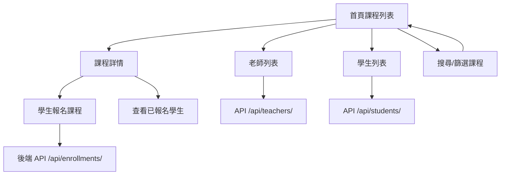

# 線上課程平台 Online Course Platform

[](https://www.python.org/)
[](https://www.djangoproject.com/)
[](https://www.django-rest-framework.org/)
[](https://tailwindcss.com/)
[](https://www.sqlite.org/)
[](https://developer.mozilla.org/en-US/docs/Web/HTML)
[](https://pypi.org/project/django-cors-headers/)

## 專案簡介

這是一個線上課程管理平台，提供學生與老師之間的課程管理與報名功能。
專案使用 **Django + Django REST Framework** 作為後端，前端使用 **Django Templates + Tailwind CSS**，並透過 **Django Admin** 管理資料。

## 專案特色

- 多對多關聯：課程可對應多位老師，老師可教授多門課程
- 學生報名限制：同一課程僅能報名一次（資料庫層級限制）
- 課程搜尋與篩選：依關鍵字（課程名稱／說明／老師姓名）或依老師篩選課程
- 權限控管：新增老師、新增／刪除課程僅限管理員操作
- 前後端整合：REST API（含分頁）+ Django Templates
- 前端美化：Tailwind CSS 卡片式 UI，含完整空狀態設計
- 管理方便：Django Admin 完整管理資料
- 單元測試：涵蓋 model 限制、API 行為、權限控管、搜尋功能

## 前端頁面示意

### 課程列表（Course List）


### 課程詳情（Course Detail）


### 老師列表（Teacher List）


### 學生列表（Student List）


### Django Admin 後台管理


### Django REST framework


## 技術架構

**後端**

- Python 3
- Django 6：網站框架，處理前端 template、後端邏輯
- Django REST Framework (DRF)：提供 API 功能、分頁、權限控管
- SQLite：開發用資料庫
- Django Admin：後台管理老師、學生、課程資料

**前端**

- Django Templates：渲染 HTML 頁面（版型繼承 + 空狀態設計）
- Tailwind CSS：快速製作響應式 UI、卡片、表單
- HTML / CSS / JavaScript：前端基礎互動

**其他**

- django-cors-headers：允許前端與 API 跨域請求（開發階段使用）
- python-dotenv：讀取 `.env` 環境變數
- venv：Python 虛擬環境管理專案依賴

## 專案流程圖



## 資料模型


### Teacher

| 欄位名稱 | 型別       | 說明           |
| -------- | ---------- | -------------- |
| id       | Integer    | 主鍵，自動產生 |
| name     | Char(100)  | 老師姓名       |
| email    | EmailField | 電子信箱，唯一 |
| bio      | Text       | 老師介紹，可選 |

### Student

| 欄位名稱 | 型別       | 說明                                                     |
| -------- | ---------- | -------------------------------------------------------- |
| id       | Integer    | 主鍵，自動產生                                           |
| name     | Char(100)  | 學生姓名                                                 |
| email    | EmailField | 電子信箱，唯一                                           |
| level    | Char(20)   | beginner / intermediate / advanced（初級 / 中級 / 高級） |

### Course

| 欄位名稱    | 型別                      | 說明               |
| ----------- | ------------------------- | ------------------ |
| id          | Integer                   | 主鍵，自動產生     |
| title       | Char(200)                 | 課程名稱           |
| description | Text                      | 課程說明           |
| created_at  | DateTime                  | 課程建立時間       |
| teachers    | ManyToManyField → Teacher | 授課老師（可多位） |

### Course_teachers（Course 與 Teacher 的多對多中介表，由 Django 自動建立）

| 欄位名稱   | 型別                 | 說明     |
| ---------- | -------------------- | -------- |
| course_id  | ForeignKey → Course  | 課程     |
| teacher_id | ForeignKey → Teacher | 授課老師 |

### Enrollment（Course 與 Student 的報名紀錄表）

| 欄位名稱    | 型別                 | 說明           |
| ----------- | -------------------- | -------------- |
| id          | Integer              | 主鍵，自動產生 |
| student_id  | ForeignKey → Student | 報名學生       |
| course_id   | ForeignKey → Course  | 報名課程       |
| enrolled_at | DateTime             | 報名時間       |

> **限制**：`(student_id, course_id)` 設定 `unique_together`，確保學生對同一門課程只能報名一次；重複報名時 API 會回傳 `400` 錯誤。

## API 設計（RESTful）

| 功能                      | 方法   | 路徑                      | 說明                                               | 需要驗證     |
| ------------------------- | ------ | ------------------------- | -------------------------------------------------- | ------------ |
| 課程列表（支援搜尋/篩選） | GET    | /api/courses/             | 列出課程，支援 `?search=關鍵字`、`?teacher=老師id` | 否           |
| 單一課程                  | GET    | /api/courses/{id}/        | 課程詳細資訊                                       | 否           |
| 新增課程                  | POST   | /api/courses/create/      | 新增課程（提供老師 ID）                            | 是（管理員） |
| 刪除課程                  | DELETE | /api/courses/{id}/delete/ | 刪除課程                                           | 是（管理員） |
| 老師列表                  | GET    | /api/teachers/            | 列出老師                                           | 否           |
| 新增老師                  | POST   | /api/teachers/            | 新增老師                                           | 是（管理員） |
| 學生列表                  | GET    | /api/students/            | 列出學生                                           | 否           |
| 新增學生                  | POST   | /api/students/            | 新增學生                                           | 否           |
| 學生報名課程              | POST   | /api/enrollments/         | 報名課程                                           | 否           |

> 管理員身分判斷為 Django 使用者的 `is_staff=True`（`createsuperuser` 建立的帳號預設具備）。API 驗證方式支援 Session（瀏覽器登入 Admin 後即可直接操作 API）與 HTTP Basic Auth（方便用 Postman/curl 測試）。

## 課程搜尋 / 篩選

`GET /api/courses/` 與前端課程列表頁 `/courses/` 皆支援以下 query 參數，可單獨或合併使用：

| 參數      | 說明                                         | 範例           |
| --------- | -------------------------------------------- | -------------- |
| `search`  | 比對課程標題、說明、授課老師姓名（模糊搜尋） | `?search=英文` |
| `teacher` | 只顯示指定老師教授的課程（帶老師 id）        | `?teacher=1`   |

```
GET /api/courses/?search=英文&teacher=1
```

## API 使用範例

### 1. 新增老師（需以管理員身分登入）

**Request** `POST /api/teachers/`

```json
{
  "name": "王老師",
  "email": "teacher_wang@example.com",
  "bio": "專長英文與文法教學"
}
```

**Response** `201 Created`

```json
{
  "id": 1,
  "name": "王老師",
  "email": "teacher_wang@example.com",
  "bio": "專長英文與文法教學",
  "course_count": 0
}
```

**Response（未登入）** `401 Unauthorized` 或 `403 Forbidden`

### 2. 新增學生

**Request** `POST /api/students/`

```json
{
  "name": "小明",
  "email": "student_ming@example.com",
  "level": "beginner"
}
```

**Response** `201 Created`

```json
{
  "id": 2,
  "name": "小明",
  "email": "student_ming@example.com",
  "level": "beginner"
}
```

### 3. 新增課程（需以管理員身分登入）

**Request** `POST /api/courses/create/`

```json
{
  "title": "英文入門",
  "description": "基礎文法與聽力練習",
  "teachers": [1, 2]
}
```

**Response** `201 Created`

```json
{
  "id": 1,
  "title": "英文入門",
  "description": "基礎文法與聽力練習",
  "created_at": "2026-08-30T10:00:00Z",
  "teachers": [1, 2]
}
```

### 4. 學生報名課程

**Request** `POST /api/enrollments/`

```json
{
  "student_id": 2,
  "course_id": 1
}
```

**Response（成功）** `201 Created`

```json
{
  "message": "報名成功",
  "enrollment_id": 1,
  "student": "小明",
  "course": "英文入門"
}
```

**Response（重複報名）** `400 Bad Request`

```json
{
  "detail": ["此學生已報名過此課程"]
}
```

## 專案架構

```
202507-online-course/
├── manage.py
├── requirements.txt
├── .env                   # 環境變數（不上傳至 GitHub）
├── .env.example           # 環境變數範例
├── .gitignore
├── db.sqlite3              # 不上傳至 GitHub
├── docs/
│   └── database.dbml       # dbdiagram.io 用的資料模型定義
├── project/
│   ├── settings.py
│   ├── urls.py
│   └── wsgi.py
├── courses/
│   ├── admin.py
│   ├── models.py
│   ├── views.py
│   ├── urls.py              # HTML template 前端頁面路由
│   ├── api_urls.py          # API 路由
│   ├── serializers.py
│   ├── tests.py             # 單元測試
│   ├── migrations/
│   ├── templates/
│   │   ├── home.html         # 共用版型（nav / footer / messages）
│   │   └── courses/
│   │       ├── course_list.html
│   │       ├── course_detail.html
│   │       ├── teacher_list.html
│   │       └── student_list.html
│   └── static/css/
└── README.md
```

## 安裝與啟動

### 1. Clone 專案

```bash
git clone https://github.com/tina0326-88/202507-django-practice.git
cd 202507-online-course
```

### 2. 建立虛擬環境並安裝依賴

```bash
python -m venv venv
source venv/bin/activate     # Mac/Linux
venv\Scripts\activate        # Windows
pip install -r requirements.txt
```

### 3. 設定環境變數

複製範例檔並依需求修改：

```bash
cp .env.example .env
```

用以下指令產生安全的隨機 `SECRET_KEY`，貼到 `.env` 裡：

```bash
python -c "from django.core.management.utils import get_random_secret_key; print(get_random_secret_key())"
```

`.env` 內容範例：

```
SECRET_KEY=你產生的隨機字串
DEBUG=True
```

### 4. 資料庫遷移

```bash
python manage.py makemigrations
python manage.py migrate
```

### 5. 建立 superuser（同時作為 API 管理員帳號）

```bash
python manage.py createsuperuser
```

### 6. 啟動開發伺服器

```bash
python manage.py runserver
```

## 測試

執行單元測試，涵蓋 model 限制（重複報名）、API 端點、權限控管、搜尋/篩選功能：

```bash
python manage.py test
```

## 前端網址

| 頁面                    | 路徑                                                                        |
| ----------------------- | --------------------------------------------------------------------------- |
| 課程列表（含搜尋/篩選） | [http://127.0.0.1:8000/courses/](http://127.0.0.1:8000/courses/)            |
| 課程詳情                | [http://127.0.0.1:8000/courses/{課程id}/](http://127.0.0.1:8000/courses/2/) |
| 老師列表                | [http://127.0.0.1:8000/teachers/](http://127.0.0.1:8000/teachers/)          |
| 學生列表                | [http://127.0.0.1:8000/students/](http://127.0.0.1:8000/students/)          |
| Django Admin            | [http://127.0.0.1:8000/admin/](http://127.0.0.1:8000/admin/)                |

## 使用方式

1. 在 Admin 新增老師與學生（或用已登入管理員身分透過 API 新增老師）
2. 在課程列表頁搜尋、篩選課程，或查看全部課程
3. 在課程詳情頁報名學生
4. 已報名學生不可重複報名同一課程
5. 老師與學生資料可透過 Admin 管理
6. 管理員可透過 API 新增／刪除課程

## 未來優化

- [x] API 分頁
- [x] API 權限控管（新增老師、新增/刪除課程限管理員）
- [x] 前端搜尋與篩選課程功能
- [x] 空狀態前端設計
- [ ] 取消報名（學生自行退選課程）功能
- [ ] 老師／學生的編輯、刪除 API
- [ ] 部署設定（正式環境資料庫、靜態檔案處理）

## 版權聲明

此專案僅供個人學習與紀錄使用，無授權任何學習教材用途與商業用途。

## 致謝

感謝所有為這個專案提供建議和協助的人。
